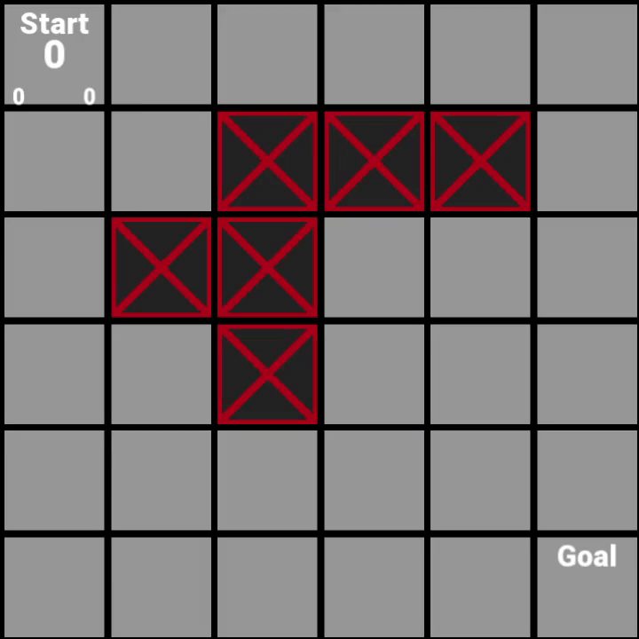

# <b>PathVisualiser</b>
Step-by-step pathfinding algorithm visualiser written in C++ with the SFML library for graphics.

 

  

## Controls

| Keybind  | Action |
| ------------- | ------------- |
| S | Set start tile. |
| G | Set goal tile. |
| Space/N | Step through pathfinder. |
| Mouse Click | Toggle obstacle. |

 

## Help

### <u>A* Pathfinding</u>

The central, largest number shows the f cost - the total cost associated with a tile.

The cost on the left is the g cost - the cost associated with reaching this tile from the start tile.

The cost on the right is the h cost - the heuristic cost representing how costly we estimate reaching the goal tile will be.